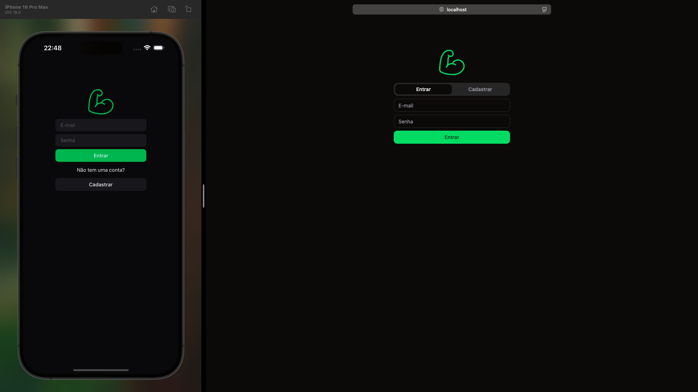
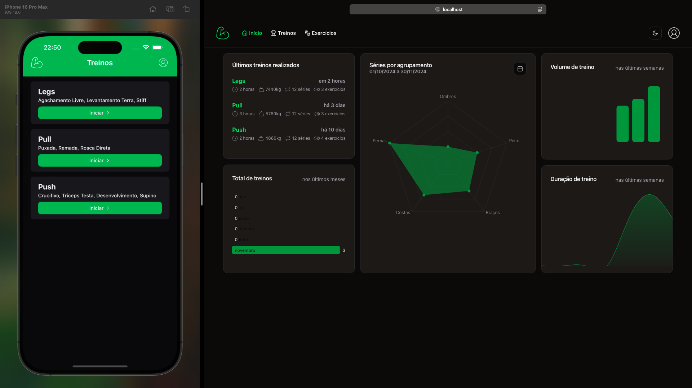
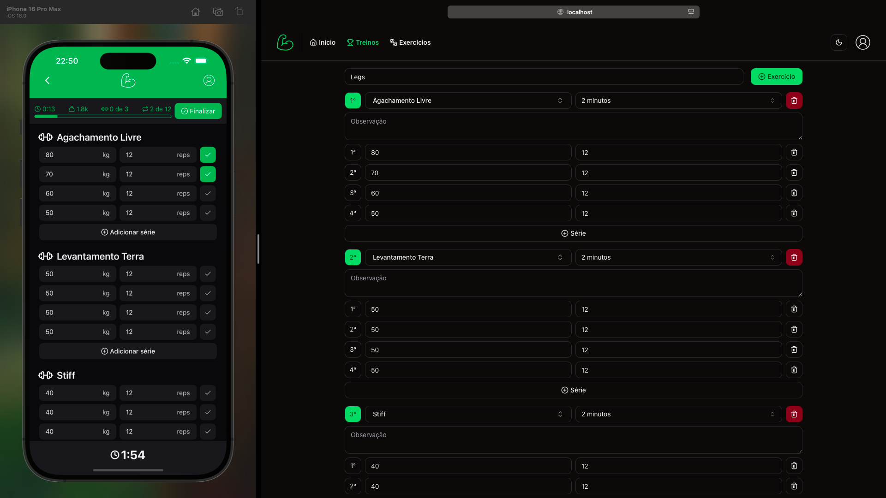
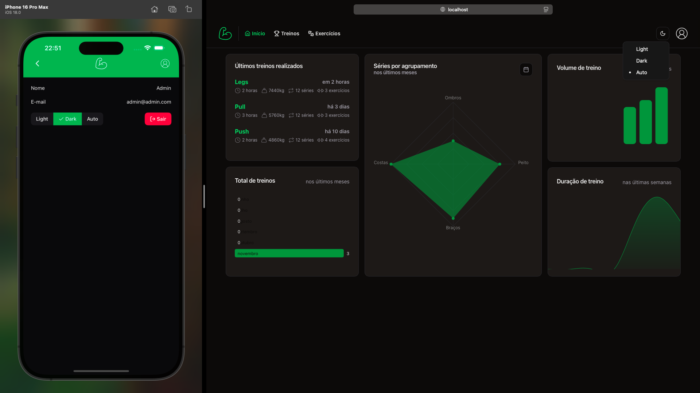
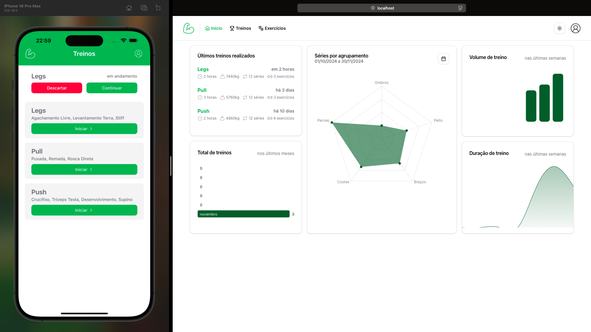

# TrainUp

## Screenshots
### Login

### Home

### Workout

### Seletor de tema

### Tema light


## Roadmap
Status|Funcionalidade
:-:| -
✅|Web/Server - CRUD de exercícios
✅|Web/Server - Montar treino: Exercícios, séries, repetições, tempo de descanso e observação por exercício
✅|Web/Server - Gráficos: Últimos treinos, total de treinos nos últimos meses, séries por agrupamento (filtrar por data), volume e duração de treino semanal
✅|Web/Server - Filtros na listagem dos exercícios e treinos
✅|Web/Mobile - Tema Light, Dark e Auto
✅|Mobile - Iniciar treino
✅|Mobile - Definir carga e reps por exercícios
✅|Mobile - Marcar série como concluída
✅|Mobile - Temporizador com o tempo de descanso para cada conclusão de série 
✅|Mobile - Finalizar treino
✅|Mobile - Descartar treino
✅|Mobile - Salvar em local storage o progresso do treino, para lembrete de continuar, caso o app for fechado
✅|Mobile/Server - Adicionar séries no treino em andamento
✅|Mobile/Server - Adicionar exercícios no treino em andamento
✅|Web/Mobile/Server - Autenticação com e-mail e senha
✅|Server - Documentação da API com Swagger
❌|Web/Mobile/Server - Tratamento de erros
❌|Web/Mobile - Validação dos forms
❌|Mobile - Tempo de descanso e notificações em background (Expo Bare)

## Rodar o projeto

## Server
```bash
cd server
cp .env.example .env
npm i
docker compose up -d
npx drizzle-kit generate
npx drizzle-kit migrate
npm run seed
npm run server
```


## Web
```bash
cd web
cp .env.local.example .env.local
npm i
npm run web
```


## Mobile
```bash
cd mobile
npm i
npm run mobile
```
